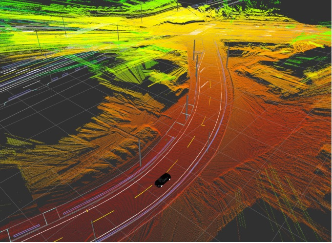
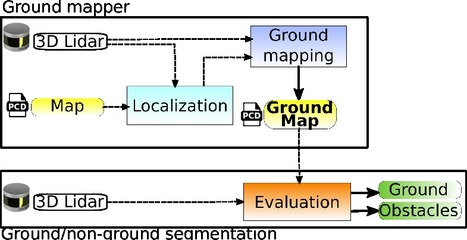
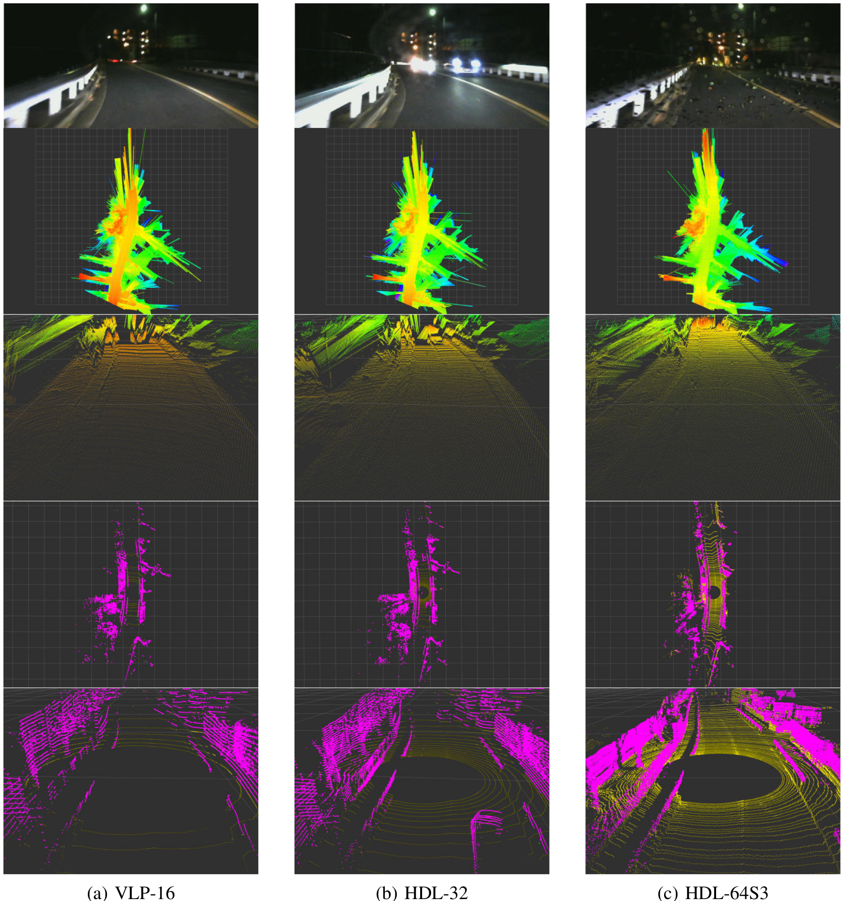

# lidar_hd_ground_mapping
HD ground mapping and segmentation by accumulation of scan data. 

## Introduction
We propose a new method to create high density ground maps for autonomous vehicles based on
low boundary elevation estimation. Ground maps are created using ray casting of laser beams in 3D LiDAR data accumulated over time and computing the lower elevation data between 3D LiDAR scans. This lower boundary works as a low envelope of the accumulated point cloud. Our low boundary ground maps are not affected by moving vehicles and objects on the road.

Our approach produces high density maps even with coarse vertical resolution 3D LiDARs, for long distances, curved roads and different elevations, it is computationally efficient allowing real-time object detection. As proof of concept, we present an application for real-time obstacle and ground segmentation of 3D LiDAR data using our high density ground maps.



##System 
This tool allows to extract HD ground maps by accumulation of localized pointcloud data. As pointcloud-based localization method, we used the Normal Distributions Transform (NDT) available in [Autoware](https://github.com/Autoware-AI/autoware.ai)

The following figure describes this tool: the ground mapper performs raycasting for every LiDAR scan beam, computes minimum height and scan accumulation; ground/non-ground segmentation divides pointcloud data according to the generated ground map.



## Demonstrations 
Here are some qualitative evaluations of our method:

- HD ground extraction example


- Segmentation example


- HD ground extraction and segmentation example


## Multiple LiDARs
Our method supports multiple 3D LiDARs, here are some qualitative evaluations:

- Nagoya data (Velodyne VLP-16, HDL-32E, HDL-64S3)


- KITTI dataset (using Velodyne HDL-64S1)


## Citation
Paper presented at ITSC 2018 (Hawai'i) is available [here](https://ieeexplore.ieee.org/abstract/document/8569764)

The complementary video for this paper is available on YouTube [here](https://youtu.be/R1p-5ko0c1g)

If you use this code, please cite our paper:

```
@inproceedings{acarballo2018,
	title={{High Density Ground Maps using Low Boundary Height Estimation for Autonomous Vehicles},
	author={Alexander Carballo, Eijiro Takeuchi, Kazuya Takeda},
	booktitle={21st IEEE International Conference on Intelligent Transportation Systems (ITSC)},
	pages={3811--381},
	year={2018},
	organization={IEEE}
}
```

## About this code
lidar_hd_ground_mapping was part of an old version of Autoware as a feature branch, which was never merged with the master branch, it was created for ROS Kinetic and a dependencies may have changed.

Please build using:
```
catkin build
```

and please run the launch file as:
```
roslaunch lidar_road_surface ground_mapping.launch
```

while there is little documentation, there are several parameters and options in the launch file to allow testing on different vehicles, generating maps and segmentation, etc.